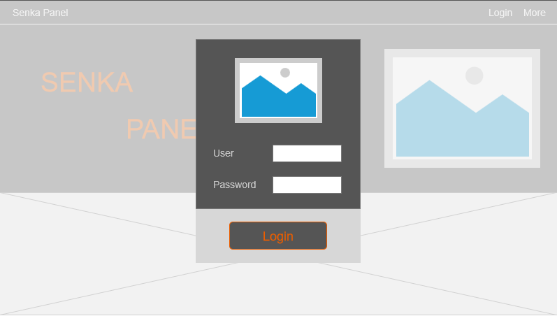

# Senka Panel（千桦面板）需求文档

Senka Panel是一个集成了服务器状态监控，服务器命令行交互，文件管理与传输功能，快捷服务器网络管理，以及设置快捷应用管理，博客界面的一个综合性服务器管理网页。

## 需求概述

在Senka Panel中期望有以下功能（无先后优先级，在编码阶段开始后新的功能追加以需求变更的方式提出）：

### 服务器管理界面：

此界面集成了上述的服务器状态监控，命令行交互，以及文件传输功能（类似于FinalShell）。

**状态监控**

1. 提供一段时间内服务器Cpu，内存，及带宽负载数据，其中Cpu负载数据建议以百分比曲线表示，曲线展示从界面启动以来开始后的负载变化，并且显示的时间长度有限制（目前建议为1分钟），并且可以查看总负载和单核心负载；内存负载显示“<当前内存占用>/<全部可用内存>”；带宽负载显示当前服务器上行数据和下行数据。
2. 提供详细进程信息，格式大致为“进程号-进程名称-cpu占用-内存使用量-创建用户-上行数据-下行数据-端口占用-关联程序”，其中“进程号”，“进程名称”，“cpu占用”，“内存使用量”，“端口占用”为必显示项，其余为可选显示项，设置可显示后如显示不下提供横向滚动条。
3. 提供界面，在此界面中可以按时间查看负载记录，并且能做风险分析（视实现难度而定）。

**命令行交互**

1. 提供命令行窗口，保留一个月内的该Terminal下所有交互记录（记录长度最好可设置）。
2. 操作日志保存在本地文件中，做体积限制。

**文件管理与传输**

1. 提供文件交互与传输功能，要求能根据命令行或程序产生的结构变更实时反应（这一点视实际开发后的性能情况，不做强制要求）。
2. 负载监控，命令行窗口，文件管理与传输功能放在一个Tab页中，布局可参照FinalShell。
3. 文件管理与传输功能界面需额外提供一个布局，类似于群晖nas的布局。

**快捷服务器网络管理**

1. 提供端口防火墙配置功能，包括端口管理和总开关；
2. 提供内网穿透配置，提供界面可以一键导入frp配置以及开启、关闭脚本生成，提供开机自启设置。
3. 提供“高级”Tab页，其中提供服务器网卡信息，期望格式化显示。
4. 针对ubuntu容易掉网卡驱动的情况给出sop，并且提供一键恢复功能（仅内网有效）。
5. 此界面布局可以参考阿里云服务器网络端口管理界面。

### 快捷应用管理

此界面提供某些应用快捷启动方式，旨在为游戏服务器以及一些常见功能提供快捷启动功能。

**创建快捷启动功能**

1. 由于服务器目标部署环境为linux（目前以ubuntu server为主），所以本功能预期提供脚本编辑界面，包括一个脚本文本框，图标上传界面，以及提供是否开机自启动选项。
2. 创建时默认创建小图标，可以在创建时给个大图标的选项。

**快捷启动布局**

1. 整体布局参考windows8全屏的开始界面的磁贴样式，点击该磁贴后其他磁贴会变淡，点击的磁贴右侧出现拓展弹框，出现开始和设置图标（播放图标和扳手图标）。
2. 界面右上角有隐藏式菜单栏以提供进一步修改，此外还有加号按钮，可以添加脚本。
3. 自动布局以左上为准，允许分组，暂时不考虑开放自由排列。

### 安全性和用户体验需求

在以上需求外需要提供各界面的权限以及多应用场景适配，多语言支持。

**权限设置**

为了保证服务器硬件、软件、数据安全，上述功能中，涉及该部分的内容需要管理员权限才能使用，高级用户可以查看，用户仅能使用非危险部分，游客（未登录用户）可以浏览不涉及到服务器提供的服务信息的部分，当前先给出以下权限配置：
|功能|管理员|高级用户|用户|游客|
|-|-|-|-|-|
|负载数据显示|√|√|x|x|
|进程信息显示|√|x|x|x|
|负载历史数据查看|√|x|x|x|
|命令行功能使用|√|x|x|x|
|文件传输功能-上传|√|√|x|x|
|文件传输功能-下载|√|√|√|x|
|网络管理|√|x|x|x|
|创建快捷启动|√|x|x|x|
|使用快捷启动|√|√|x|x|
|首页及其他内容展示页|√|√|√|√|

其中文件传输功能需要额外根据用户隔离个人数据，以保证数据隐私要求，要求如下：

1. 分为公共空间以及个人空间，公共空间所有用户可以上传文件以及下载文件。
2. 个人空间仅空间拥有者能上传，非拥有者仅能通过专有链接下载，下载链接可以设置有效时间。
3. 网站拥有者及管理者对非自身拥有的个人空间内容不可视及更改。
4. 服务器系统文件与个人存储文件隔离，以保证上传的文件不影响到系统运行安全和数据安全。

管理员用户可以在上述权限列表的基础上进一步限制界面的可用性和可视性。并且开放出相关权限管理的接口以让用户可用并入自定义界面。

**安全需求**

1. 为了保证服务器安全，要保证非管理员用户无法修改关键数据，这已通过权限设置实现。
2. 使用隐式url转发实现端口隐藏，以保护域名和端口安全。
3. 服务器仅能通过公私钥登录。
4. 文件传输功能分为两个部分：1）服务器文件管理，2）个人存储文件管理。前者通过类似FinalShell + 权限验证的方式实现，后者通过容器将个人存储文件隔离（可配置是否隔离，因为可能涉及到多硬盘）。
5. 界面使用顺序：
    
        首页 -- 登录界面 -- 渲染各功能页
            -- 其他公开界面 
    以保证用户无法修改前端界面属性以启用部分功能，以此达到安全性，对用户输入做信息验证（视实现难度而定）。
6. 内置数据库功能，其中存储用户的账户+密码信息。其中存储的密码信息为RSA加密后的密钥，并且没有任何地方存储用户的明文密码。

**多尺寸适配**

|设备|常见比例|适配方式|
|-|-|-|
|手机|9:20|默认竖向布局，可以参考windows phone布局|
|平板|16:10|默认横线布局，单个页面填满整个内容，部分内容可以向横向拓展|
|电脑|16:9|默认横向布局，单个页面填满整个内容|

详细布局会在设备原型中展现。

**多语言**

开发时默认使用中文，后期视开发难度以及翻译成本考虑开放多语言或者开放文字接口以让用户自行界面机翻。

## 界面原型

**首页**

电脑端样式，其中左上角的“Senka Panel”实现自身跳转（或默认路径跳转）；图片为一张示意图或宣传图；点击Login跳出登录窗口（暂定实现登录窗口而不是实现跳出新页面）；点击More后显示下拉菜单，里面显示官方社交帐号，Github项目账号等，添加接口允许用户添加其他链接，通用实现为链接自定义字符名+链接的形式；下面的占位框部分用户可自定义界面。

手机端样式，其中左上角的三条横线实现左侧展开菜单的效果，菜单中包含登录功能（暂定跳出新页面）和官方社交账号，Github项目账号等，添加接口允许用户添加其他链接，通用实现为链接自定义字符名+链接的形式；

**登录弹窗**

电脑端点击登录后跳出的登录对话框的样式。

手机端点击菜单按钮后显示的左侧菜单。

手机端点击登录按钮后显示的登录页面。

**登录后首页**

电脑端登录完成后显示的界面。

手机端登录完成后显示的界面。

**应用界面**

电脑端Application界面。

手机端Application界面。

**监控界面**

电脑端Monitor界面。

手机端Monitor界面。

**终端界面**

电脑端终端界面。

手机端终端界面。

**网络管理**

电脑端Frp管理和端口管理。

手机端Frp设置界面。

电脑端文件界面。

手机端文件界面。

## 其他要求及说明

要求前端和后端分别达成以下要求。

### 前端

在前文中说明了用户权限问题，为了保证前端界面的权限限制不会因用户启用前端调试而失效，要求：

    1）对于没有操作权限的用户，不渲染可操作内容，或者渲染可操作内容，但是不实现任何接口调用。
    
    2）前端的任何涉及到接口调用的内容由脚本动态生成。

### 后端

为了防止拥有较低权限的用户通过抓包+回溯服务器Ip+扫端口的方式强行访问相关接口，所有操作在后端都需要做以下验证：

    1）所有操作必须验证用户的签名已保证用户已登录并且拥有相关权限。

    2）服务器提供的不同级别的操作的端口需要映射到不同Ip及域名下。

    3）对外服务的域名需要有不可读性。